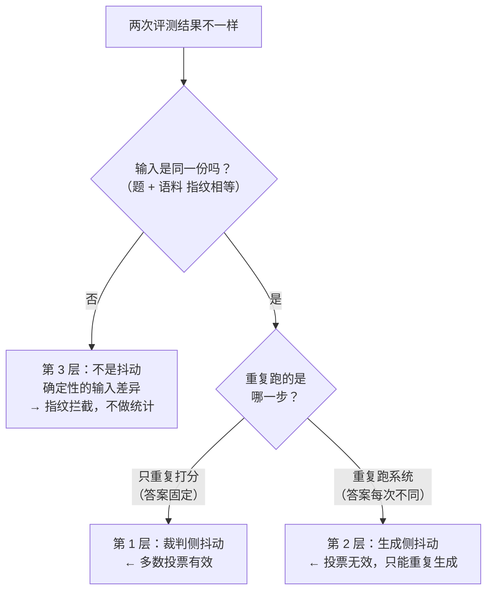

# D22 决策材料：抖动分三层 + 三个待拍板的设计点

> **这份文件是干什么的**
>
> D22（评测器）**开工前**必须一次性看全的材料。它**不是** D22 的教程 —— 教程等 D22 做完再写。
>
> 起因：2026-09-28 我问了三道题，其中一道（Q1）依赖的前提**是我自己刚抛出的新设计**，
> 一次都没讲过，用户回"为什么都找不到在哪里讲解的？完全没有想法"。
> Q1 的材料已当场补讲；这份文件补 **Q2 / Q3** 的完整材料，并把三个待拍板的设计点摊在一起。
>
> **阅读顺序建议**：§1（噪声怎么分）→ §3（要拍什么板）→ §2（为什么 `failure_reason` 只能机械推导）。
> §2 偏实现，放最后。

---

## §1 抖动分三层（原 Q3 的完整材料）

### 1.1 先把三个词定义掉

| 名词 | 一句话定义 | 为什么这里需要它 |
|---|---|---|
| **抖动** | 同样的操作做两遍，结果不一样 | 它是一切评测结论的敌人 —— "配置 A 比 B 好 4 条题"和"换个时候跑就差 4 条题"，在没有抖动数据时**无法区分** |
| **随机变量** | 每次取值都不同、但有一个稳定分布的东西 | LLM 生成的答案就是随机变量。它不是"算错了"，是**本来就没有唯一正确答案** |
| **抽样** | 从同一个随机变量身上取若干个具体值 | 重复跑 N 次生成的 N 份答案 = N 次抽样。**抽样的目的是估计分布，不是找"最准的那一次"** |

**一句话**：评测要回答的从来不是"这次跑了几分"（那只是**一次抽样**），
而是"**这个配置的分数分布在哪里，它和另一个配置的分布有没有真的分开**"。

---

### 1.2 三层各自是什么

#### 第 1 层：裁判侧抖动（测量噪声）

- **是什么**：把**同一份已经落库的答案**反复交给 judge（裁判模型）打分，分数不一样。
- **实测证据**（D20）：ε = **0.95%**（deepseek 裁判），95% Wilson 区间 `0.17% ~ 5.20%`。
  - **ε**（希腊字母 epsilon）＝ 单次判定不一致率：同一份答案重复打分，**单独看其中一次**，它和"多数投票的最终结论"不一致的比例。
  - **Wilson 区间**＝ 一种**小样本下仍然可靠**的比例置信区间。观测到 0 次不一致时不能用普通公式（会算出 `[0, 0]`，看着"绝对确定"其实毫无信息），Wilson 给的是 `[0%, 7.14%]` 这种诚实的上界。
- **处理方式**：**重复打分 + 多数投票**。3 次里 ≥2 次判错才算错。
- **为什么有效**：被测对象（那份答案）**没有变**，我们确实是在"重复测量同一个东西" —— 这是统计学的适用场景。
- **成本**：judge 调用 ×3。450 次打分从约 6 分钟变约 19 分钟，量级可接受。
- ⚠ **前提未验证**：多数投票能降噪，前提是"各次误差独立"。同款模型有系统性偏好（同向偏差）时，
  投票会一起错。D20 实测**无法验证独立性**，所以门槛数字要按保守口径取，不能只报乐观值。

#### 第 2 层：生成侧抖动（被测对象本身的随机性）

- **是什么**：**同一道题、同一配置**，重复跑被测系统，**答案本身就是随机变量**。
- **实测证据**（D21，本项最重要的发现）：

  |  | 第 1 次运行 | 第 2 次运行 |
  |---|---|---|
  | B01（跨文档题）的系统答案 | 459 字 | 511 字 |
  | judge 5 次打分 | `[4,4,4,4,4]` → **判对** | `[2,2,2,2,2]` → **判错** |

  judge **各自内部 5 次完全一致**，但**两次的判定结果相反**。
- **处理方式**：**重复打分救不了它**。只有两条路 —— ① **重复生成**（成本 N 倍）；② 接受它，并**把噪声门槛按它的散布放大**。
- **为什么投票无效**：重复测量只能压掉"**同一份答案被重复测量**"的噪声，
  压不掉"**答案本身在变**"这一层。这两个是不同的东西，不能互相顶替。
- **一句话自检**：**"我重复的是裁判，还是输入？"**

#### 第 3 层：不是抖动（确定性的输入差异）

- **是什么**：两次结果不同不是随机，而是**输入被换过** —— 语料改了、评测集改了、配置串了。
- **特征**：**再重复多少次都不会收敛**，因为每次测的根本不是同一个东西。
- **为什么最危险**：它**看起来像抖动**（"两次结果不一样嘛"），于是人会本能地"多跑几次取平均"——
  而**平均一个混合了两个不同系统的结果，得到的数字没有任何含义，却看起来更"稳"**。
- **实测证据**（D21 已证实这个缺口）：
  - 改 `d21_corpus.py` 里一句正文 → 不带 `--force` 跑 `d21_seed` → **语料根本没更新**、
    评测集逐字相同、指纹不变、**三处都不出声**。
  - 根因：**指纹只冻结了「题」，没冻结「语料」—— 半张网**。等于"考卷封了，教材可以随时换"。
- **处理方式**：**不做统计，做前置拦截**。两次跑的输入指纹必须相等，不等就**拒绝出报告**。

---

### 1.3 为什么三层的处理方式必须不同（本质区别）

| | 被测对象 | 我们在做的事 | 正确的数学工具 |
|---|---|---|---|
| 第 1 层 | **不变**（同一份答案） | **重复测量同一个值** | 统计学：均值、方差、置信区间、多数投票 |
| 第 2 层 | **每次不同** | **给一个随机变量抽样** | 抽样：要的是**分布**，不是更准的点估计 |
| 第 3 层 | **偷偷换了** | 测了两个不同的东西 | **都不是** —— 工具是"指纹比对"，属于工程约束不是数学 |

**一个必须记住的推论**：当两个配置的**分数分布互相重叠**时，
"A 比 B 好 4 条题"这个结论**根本不能下** —— 无论重复多少次。
`+10%`（PRD 的验收线，50 条题上约 4 条）能不能判，取决于**抖动散布相对它有多大**，
而不是取决于"我们跑得很努力"。

---

### 1.4 诊断流程：怎么知道抖动在哪一层

**这套流程的价值**：让你在"结果不好看"的时候，知道**该改哪里**，而不是无差别地"多跑几遍"。

| 步 | 动作 | 目的 | 成本 |
|---|---|---|---|
| **① 先冻结** | 核对两次跑的**题指纹 + 语料指纹**是否相等 | 不等 → **第 3 层，立刻停下查输入**，不要动统计 | 0（纯查库） |
| **② 测裁判侧** | 把**第一份答案落库固定**，对**同一份答案**重复打分 M 次 → 看分数散布 | **答案被钉住**，所以变化只可能来自裁判 → 得到纯裁判侧噪声 | M 次打分 |
| **③ 测生成侧** | 固定题 + 固定配置，重复跑 N 次得 N 份答案；**每份答案先打分 M 次取多数**（先把裁判噪声压掉），再比较 N 份答案的"多数结论" | 裁判噪声被压掉后剩下的差异 = **纯生成侧** | N × M 次打分 + N 次生成 |
| **④ 比大小** | 谁大先解决谁 | 若生成侧 ≫ 裁判侧 → **3 次投票等于白花钱**（D21 实测就是这个结论） | 0 |
| **⑤ 定 N** | 用 ③ 量出的生成侧散布，反推"D23 要生成几次才够" | **先量再定**，别先花 3 倍钱 | 0 |

**注意步 ③ 里"取多数"这一步不能省**：如果每份答案只打 1 次分，那么"N 份答案之间的差异"里
**混着裁判噪声**，你会把裁判的抖动误记成生成的抖动，从而**夸大生成侧**。

**代价**：步 ③ 是 `N × M` 次打分。取 N=3、M=3 → 每题 9 次打分 + 3 次生成。
所以它**只对少数几条题做**（挑题、不跑全量），这是"探针"而不是"主表"的做法。

---

### 1.5 这一层里最容易犯的三个错

**错 1：用统计工具去处理第 3 层。**
→ 表现：输入被换了却"多跑几次取平均"，得到一个无意义的中间值。
→ 修法：**报告生成前强校验指纹**，不相等直接拒绝出报告（不是打印一行警告）。

**错 2：重复生成 N 次后"取最好的一次"。**
→ 这是 **选择偏差**（从 N 次抽样里挑出运气最好的那次当成系统水平），会让分数**系统性虚高**，
而且**恰恰在最不稳定的题上虚高最多**。
→ 正确做法：**取多数结论**（或报中位数），并且**把散布一起报出来**（"3 次里 2 次判对"比"3 次里最好那次判对"诚实得多）。

**错 3：把不同口径的"门槛"数字并列比较。**
→ D20 报"门槛 2.9 条"用的是 ε **点估计** 0.95%；
  D21 报"门槛 11.42 条"用的是 ε 的 **Wilson 上界** 7.14%。
  **两个数不是同一把尺子**，放在一起会得出"两次测量矛盾"的错误结论。
→ 修法：未来引用门槛必须**连口径一起写**（点估计 / 保守上界）。

---

### 1.6 对 D22 / D23 的操作结论

| 阶段 | 做法 | 理由 |
|---|---|---|
| **D22 主表**（跑 50 条，供 D23 用） | **生成 1 次 + 打分 3 次** | D22 验收点（单条可评分 / 明细有行）**不依赖**生成次数；成本可控 |
| **D22 副探针**（只挑 5~10 条题） | **生成 3 次 × 每份打分 3 次** | 用数据量出"生成侧散布到底多大"，供 D23 决定要不要生成 3 次 |
| **D23 消融** | 待探针数据出来再定 | **先量再定**，别先花 3 倍钱买一个可能不需要的方差下降 |

**为什么参数必须在 D22 就做出来（哪怕默认 1）**：它决定 runner（评测执行器）的**主干结构**
—— 是"生成 1 次 → 打分 3 次"还是"生成 N 次 → 每份打分 M 次"。
结构写到一半再改等于重写，而 D23 的消融脚本、D24 的报告抽样都**依赖这个结构**。

---

## §2 为什么 `failure_reason` 只能机械推导（原 Q2 的精炼版）

> **`failure_reason`（失败归因）**：一个短字符串，说明这道题**为什么**没通过。
> 它存在的唯一目的是让报告能做**失败模式聚类** —— "这次失败里，有几条是没检索到、有几条是编造"。
>
> **"机械推导"**＝由一段**纯函数**从分数算出来，而不是让模型自由发挥。
> **纯函数**：不依赖任何外部状态、输入相同输出必定相同的函数。它可单测、可复算、可以拿一条断言钉住。

### 2.1 三条理由（为什么不能让 judge 直接吐这个字段）

最自然的写法是：让 judge 在 JSON 里多吐一个 `"failure_reason": "..."`。**这条路是错的。**

| 问题 | 具体表现 | 后果 |
|---|---|---|
| **同义异形** | 5 次调用可能写出"检索未命中"/"资料缺失"/"没找到相关内容"/"知识库无此信息" | 聚类时被算成 **4 类** → 报告里的失败模式分布是**假的** |
| **不可复现** | 同一个答案重跑，judge 换一种措辞 | 同一份报告**两次不一样**，谁也没法核对 |
| **不可测** | 自由文本没法写断言（"这条应该是 `hallucination`"无法机检） | 这个字段**永远不会红**，坏了也没人知道 |

### 2.2 判据（一句话）

> **"这个字段要不要被机器拿去分类、聚合或断言？"**
> **要 → 它必须是枚举，且只能由纯函数从分数推导出来。**

judge 只输出**数字分数** —— 那是它不可替代的部分（语义判断）；
"为什么失败"是**从分数反推的规则**，规则属于代码，不属于模型。

### 2.3 怎么验证它真的机械（可执行的自检）

光写"我推导了"不算。验证动作：

1. 拿**同一份答案**，重复打分 10 次（只重复裁判，答案钉死 → 隔离第 1 层抖动）；
2. 每次都走一遍推导函数，收集产生的 `failure_reason`；
3. **断言：10 次的结果必须完全相同**。

→ 如果 judge 吐自由文本，这一步几乎必然出现多种写法 → 当场暴露。
→ 如果推导函数里有非确定性（比如按时间戳分支），也会被这一步抓出来。

### 2.4 同族先例（项目里已经踩过一次）

D14：`messages.tool_calls` 被 SQLAlchemy 存成 **JSON 字面量 `null`** 而非 SQL `NULL`
→ `IS NULL` 恒为假 → **同一语义有两种表示**，整片逻辑**静默失效**。
→ 与"同义异形"是同一个病：**一个字段允许有多种写法，下游的聚合就一定是假的。**

---

## §3 三个待拍板的设计点

> 这三个是**设计输入**，必须在动第一行代码之前定完。理由：
> ① 生成次数决定 runner **主干结构**；② 指纹覆盖范围与 `failure_reason` 取值都是**建表 schema 决策**，
> 表建好再改要写迁移；③ D23 的消融脚本、D24 的报告抽样都依赖 D22 的表结构，会一路传染。

### 决策 1：生成要不要也重复 N 次？

**已知**：生成侧抖动 ≫ 裁判侧（B01 实测）。
**不知道**：抖动**到底多大** —— 1 个案例推不出分布，可能就是这一条题特别飘。

**候选**：

| 方案 | 内容 | 代价 | 风险 |
|---|---|---|---|
| A | 生成 1 次（只重复打分 3 次） | 150 次生成 ≈ 15~25 分钟 | 若生成侧散布大，配置间差异会被它淹没，**且无法归因** |
| B | 生成 3 次 | 450 次生成 ≈ 45~75 分钟（+打分 ≈ 19 分钟） | 先花了 3 倍钱，可能换来的方差下降很小 |
| **C（推荐）** | **A 做 D22 主表 + 小探针先量散布** | 全量 1 次 + 少量题 ×3 | 探针本身有成本，但把它**限制在 5~10 条题**上，代价很小 |

**推荐 C 的核心理由**：D22 的验收点不依赖生成次数，而"要不要 ×3"这个问题**可以用数据回答**，
不应该靠拍脑袋。用 1 个案例的观察去决定 150 次运行的成本结构，不划算。

**反面意见（A 就够）也成立**：如果生成抖动只集中在少数几道题上，×3 是花 3 倍成本买一点点方差不降。

### 决策 2：指纹要不要覆盖语料？

**推荐：要，且这是 D22 必做项，不是可选项。**

D21 已经证实缺口（§1.2 第 3 层）：改语料正文 → 指纹不变 → 三处都不出声。

**为什么必须现在修**：D23 的核心比较是"**同一份题、同一份语料、三个检索配置**"。
如果语料在配置之间被换过，那个对比就是假的 —— **而不会有任何报错**。

**实现要点**：

1. `compute_corpus_fingerprint()` = 8 篇正文按 slug 排序拼接后的 sha256；
2. **单独一列，不和 `dataset_fingerprint` 合并**。理由：两者独立变化，
   合在一起时"变了"**无法归因**（是题变了还是语料变了？）；
3. 同步修 `d21_seed`：语料指纹不匹配时**报错**（要求显式 `--force`），不再静默跳过。

### 决策 3：`failure_reason` 枚举取值

**推荐：6 个值 + 一张纯函数推导规则表。**

| 值 | 含义 | 触发条件（从维度分推导） | 优先级 |
|---|---|---|---|
| `system_error` | 没跑成 | 跑系统阶段就失败（LLM 全通道挂 / 超时 / 异常） | 0 |
| `tool_miss` | 没调对工具 | C 类题 `expected_tool` 明确，实际未调用或调了别的 | 1 |
| `hallucination` | 编造 | `faithfulness ≤ 2`（答了检索片段里没有的内容） | 2 |
| `incomplete` | 答不全 | `completeness ≤ 2` | 3 |
| `wrong_answer` | 答错 | `correctness ≤ 2` | 4 |
| `None`（无归因） | 通过 | `passed = True` | — |

**优先级为什么这么排：上游原因优先于下游表现。**
"没调工具"是根因，"答错了"是它的结果。如果一律记成 `wrong_answer`，
**"工具选择错误"这个失败模式就被藏起来了** —— 而它恰恰是 C 类题存在的意义。

**要拍板的一条**：C 类题"没调工具但答案侥幸对了"，算不算通过？
→ 推荐**算不通过**（`tool_miss` 有否决权）。C 类题测的就是工具调用能力，答案对不是它要测的东西。

**必须指出的一个 PRD 内部矛盾**：PRD §10 的 DDL 里有 `sequence_ok`（多步题的调用序列是否合理），
但今天**没有** multi_step 类题 —— v4.0 的 F7.6 说加 D 类题会让总数 50→60，
而 §13.2 的 D21 写的是 50 条（A30/B10/C10）。**两处自相矛盾。**

→ 推荐：**`sequence_ok` 先不建**。建一个永远为 NULL 的列，会让 `SELECT sequence_ok`
看起来像"实现了但都不通过"（同族：D14 的 JSON null 让 `IS NULL` 恒假）。
等 D 类题真落地时，连同 `eval_cases.expected_call_sequence` 一起加。

---

## §4 自测题

1. 两次评测结果不一样。说出**至少三个**完全不同的原因，并说明**各用什么工具**去处理。
   （提示：区分"被测对象变了"和"测量有误差"）
2. 为什么"重复打分 3 次取多数"能压噪，而**同样重复 3 次**对生成侧抖动无效？
   用一句话说清两者的本质差别。
3. 你重复生成 3 次，分别得分 `[5, 4, 2]`。同事说"报 5 吧，最高分"。
   —— 这为什么是错的？给出一个正确报法。
4. D20 说"门槛 2.9 条"，D21 说"门槛 11.42 条"。这两个数**矛盾吗**？为什么？
5. `failure_reason` 为什么不能直接让 judge 吐出来？给出**三条理由 + 一句判据**。
6. 你要验证"`failure_reason` 真的是机械推导的"。写出**具体验证步骤**（要能写成断言）。

---

## §5 与其它文档的关系

| 文档 | 内容 |
|---|---|
| [`D20-总结.md`](D20-总结.md) | 怎么量（ε / 校准探针 / 消融方法论）—— **D20 唯一复习入口** |
| [`D21-评测集与语料.md`](D21-评测集与语料.md) | 要量的东西（8 篇语料 / 50 条题 / 指纹 / `doc_ids` 纪律） |
| **本文件** | **量之前要先想清的事**（抖动三层 / 三个待拍板点） |
| `D22-*`（待写） | 评测器本身（runner / `eval_case_results` / 评分器） |
