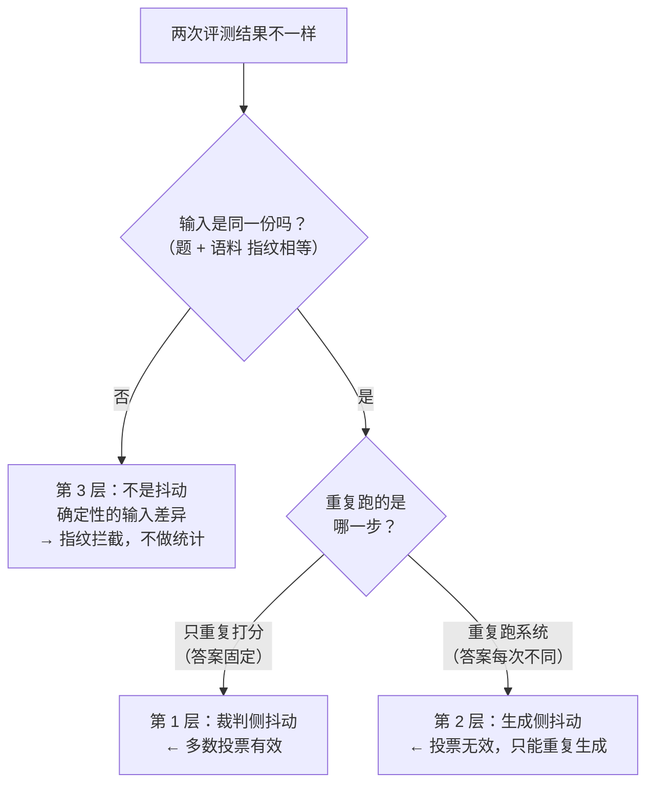

# 评测体系整体说明 —— 从零读通，到能对着面试官讲

> **本文档的角色（2026-10-01 新建，由用户指定）**：
> 本文是**评测体系的单文件通读版** —— 目标是「**从零到一条线**，读完能复述」。
> 它是为「**从头复习**」与「**面试讲述**」两个场景写的，**不是新的结论权威**。
>
> **⚠ 三条自我约束（避免造出第二处权威）**：
> 1. **本文不产生任何新数字**。每个数字都来自已存在的文件，出处见 **附录 A 数据来源索引**。
> 2. **口径一律照抄原文**，包括「点估计 / 保守口径」这类必须并报的限定 —— 本文不合并、不简化口径。
> 3. 与既有文件的分工：**[`评测总纲.md`](评测总纲.md) = 唯一入口与口径登记**；
>    各日教程 = 当天怎么做的现场记录；探针文件 = 原始数据；本文 = **一条线的叙事版**。
>    本文与 [`评测总纲.md`](评测总纲.md) §1 骨架的关系：**本文是该骨架的完整先行版**，
>    总纲主体落地时**吸收本文的叙事**、本文按角色行降级为过程记录。
>
> **口径截至 D24（2026-09-30）**。已标注的两个「待更新点」见 §4.1 与 §6.3。

---

## 怎么读本文

| 你的目的 | 读哪几章 |
|---|---|
| **30 秒知道这东西在干嘛** | 第 0 章 |
| **从头理解设计与动机**（今天的主要目的） | 第 1 章 → 第 2 章 → 第 3 章 |
| **知道最后测出了什么** | 第 4 章 → 第 6 章 |
| **面试前突击** | 第 0 章 + 第 7 章（讲述稿 + 亮点 + 追问 + 速查卡） |
| **被追问「你们踩过什么坑」** | 第 5 章（**单独一章，这是最有说服力的部分**） |

**读法建议**：第 3 章的八个小节是**独立**的，可以挑着读；但**顺序不能乱**——
它们的依赖关系是 `3.1 量具 → 3.2 题 → 3.3 跑法 → 3.4 怎么分噪声 → 3.5 怎么判 → 3.6 怎么归因 → 3.7 怎么保证可复现 → 3.8 怎么讲出来`。

### 全局地图（先看这张图，后面每章都是它的放大）

```
                     ┌──────────────────────────────────────────────┐
   业务驱动 ────────► │  要证明「混合+重排 vs 纯向量 ≥ +10%」(PRD S2)  │
                     └────────────────────┬─────────────────────────┘
                                          │ 但「提升 10%」得先能被测出来
                                          ▼
        ┌─────────────────────────────────────────────────────────┐
        │  第 1 步 · 先造尺子      §3.1 量具先行（ε / 噪声门槛）    │
        │  不知道噪声多大 → 就不知道「差 4 条题」算不算数            │
        └────────────────────────────┬────────────────────────────┘
                                     ▼
        ┌─────────────────────────────────────────────────────────┐
        │  第 2 步 · 再造被测物    §3.2 评测集（50 条 + 8 篇语料）  │
        │  三类题测三种能力；两枚指纹把输入钉死                      │
        └────────────────────────────┬────────────────────────────┘
                                     ▼
        ┌─────────────────────────────────────────────────────────┐
        │  第 3 步 · 定跑法        §3.3 两阶段（生成 / 打分拆开）   │
        │  两个旋钮：generation_runs（跑几次）runs_per_case（打几次）│
        └────────────────────────────┬────────────────────────────┘
                                     ▼
        ┌─────────────────────────────────────────────────────────┐
        │  第 4 步 · 跑第一次      结果 88% / 92% / 90% —— 有差异！ │
        └────────────────────────────┬────────────────────────────┘
                                     ▼
        ┌─────────────────────────────────────────────────────────┐
        │  第 5 步 · 深挖那次差异   ★ 15 条失败里 13 条是「假失败」 │
        │  §3.5 判定路径分两条 → 修尺子 → 重跑                     │
        └────────────────────────────┬────────────────────────────┘
                                     ▼
        ┌─────────────────────────────────────────────────────────┐
        │  第 6 步 · 重跑后         98% / 98% / 98% —— 全平了       │
        │  全平有三种可能，答案级指标分不出来 → 必须下沉           │
        └────────────────────────────┬────────────────────────────┘
                                     ▼
        ┌─────────────────────────────────────────────────────────┐
        │  第 7 步 · 下沉到检索层   100% / 100% / 100%（零 token）  │
        │  §3.4 三层天花板 → 瓶颈不是配置，是【任务难度】           │
        └────────────────────────────┬────────────────────────────┘
                                     ▼
        ┌─────────────────────────────────────────────────────────┐
        │  第 8 步 · 讲出来        §3.8 报告＝表现层（零新数字）    │
        │  §3.6 归因可机械复算 + §3.7 四道可复现闸门               │
        └─────────────────────────────────────────────────────────┘
```

---

## 第 0 章 · 30 秒看懂这套评测

### 0.1 一句话版本

> **给 RAG 系统造一把有刻度的尺子，用它量出「三种检索配置里哪个更好」；
> 量完发现三种一样好——于是证明了问题不在配置，在于题目太简单。**

**名词注解（第一次出现就定义，下同）**：

- **RAG**（Retrieval-Augmented Generation，检索增强生成）：先从知识库**检索**相关片段，
  再把片段拼进提示词让大模型**照着片段回答**。本项目整条链路就是 `问 → 检索 → 拼 prompt → 回答`。
- **检索配置**：同一份语料、同一个模型，只换「怎么找片段」的那套算法。本项目有三档（A / B / C，见 §3.2）。
- **消融**（ablation）：**一次只拿掉/加上一个部件，其余全不动，各跑一遍比差值**——
  差值就是这个部件的**净贡献**。学名叫**归因**。
  类比：给打包产物做了三项优化、体积降了，想知道**是哪一项**贡献的，就得一次只关一项分别构建。
  一把全开一把全关，你只知道总效果，永远不知道谁在起作用。

### 0.2 为什么不能「看几个例子觉得挺好」

三个失效点，每一个都**不会报错**：

| 失效点 | 具体表现 | 后果 |
|---|---|---|
| **抽样随缘** | 随手挑几个问题试，每个都答得不错 | 挑到的是**最容易**的那批 → 得出「系统很好」 |
| **没有噪声概念** | 换个时间再跑一次，结果就不一样 | 分不清「配置 A 真的更好」和「今天运气好」 |
| **改动后无法归因** | 同时上了混合检索和重排，分数涨了 | 涨的部分**归给谁**？两个变量一起动，永远说不清 |

### 0.3 评测有三个层次，混起来就会答错

这是整套设计的**出发点**。一次 RAG 评测其实是一条**三层流水线**，每层都会失真：

```
  ① 检索层     问题 → retrieve() → 排好序的片段列表
                   ↓  这一层错了，后面全错
  ② 生成层     大模型读片段 → 写出答案
                   ↓  这一层是随机的（同一道题两次答案不同，实测 10.0%）
  ③ 判定层     裁判模型拿参考答案打分
                   ↓  这一层也有噪声（实测 ε = 0.95%）
  ─────────────────────────────────────────────
  答案级指标（准确率）= 三层噪声叠加后剩下的那一点信号
```

**关键的认知转折在这里**：如果把三层混在一个「准确率」里，那么当准确率**没有差异**时，
你**分不清**是下面哪一种：

| 可能 | 含义 | 怎么办 |
|---|---|---|
| (a) 三个配置确实一样好 | 真实结论 | 认了 |
| (b) 都在天花板（题太简单） | 指标量不出差异 | **把题变难** |
| (c) 判定层坏了（假失败把差异吃掉） | 尺子坏了 | **修尺子** |

**整套评测体系的设计，本质就是围绕「如何把 (a) (b) (c) 分开」展开的。**

---

## 第 1 章 · 为什么要有评测：不评测会怎样

### 1.1 三个「不评测」的真实代价

| 不评测 | 会发生什么 | 反例（本项目真实发生过的） |
|---|---|---|
| 不测 judge 的抖动 | 拿一把刻度乱跳的尺子量长度，还以为自己量得很准 | 第 1 轮探针算出 ε = 0.0000，看着「绝对稳定」，实则是**阈值带空置**导致的**必然为 0**（见 §5.1） |
| 不冻结输入 | 改了语料/评测集之后，**旧结论与新结论混着用** | `doc_ids` 指向 `documents.id`，重建语料会生成新 UUID → 所有标注集体失效 → 指标全 0%，**看上去像「检索彻底坏了」**（见 §3.7） |
| 不落库明细 | 只有一个汇总总分，失败时**无法回查是哪条题、为什么错** | 报告要求「失败案例各取 3 条」——没有明细表**根本写不出来**（见 §3.8） |

### 1.2 评测要回答的三个层次

| 层次 | 问题 | 用哪套量具 |
|---|---|---|
| ① 检索有没有捞对 | 「正确的文档」有没有被捞回来、排第几名 | `Hit@k` / `MRR` / `MRR_last`（**离线、零 token**，见 §3.1、§4.2） |
| ② 端到端答得对不对 | 最终答案对不对、有没有依据、全不全 | LLM-as-judge 三维打分 → 准确率（见 §3.3、§3.5） |
| ③ 我这次的改动到底有没有用 | 分数变化能不能**归因给那个改动** | 消融 + 噪声门槛 + 显著性判断（见 §3.4） |

**为什么必须分开**：三个问题**用的是三把不同的尺子、三种不同的噪声、三种不同的成本**。
混在一起，就等于用一把尺子同时量长度和温度。

---

## 第 2 章 · 设计总览：八个决策，一条链

**这张表是全文的目录，也是面试时「你们评测怎么设计的」的答案骨架。**

| # | 决策 | 一句话为什么 | 不这么做的后果（**且不报错**） | 数据/证据 |
|---|---|---|---|---|
| 1 | **量具先行**：先校准 judge，再测系统 | 不知道噪声多大，就不知道「提升 X%」算不算数 | 用 0.95% 的门槛去判一个真实噪声 7.14% 的差异 → **得出「显著」的假结论** | ε=0.95%(D20) / 保守 7.14%(D21) |
| 2 | **评测集三类题 + 两枚指纹** | 三类题测三种能力；指纹把「输入」钉死 | 只出有答案的题会**奖励乱编**；输入悄悄被换 → 结论不可比 | 50 条 / 8 篇 51 片 / 2 枚指纹 |
| 3 | **两阶段**：生成与打分拆开 | 两层噪声的**来源不同，应对方式也不同** | 答案和分数混在一行 → 多份答案的分数**互相污染** | `generation_runs` / `runs_per_case` |
| 4 | **抖动分三层** | 重复的**对象**不同 → 有的能投票、有的不能 | 对第 2 层用多数投票 → **投票无效还不报错** | 裁判侧 ε=0.95% vs 生成侧 10.0% |
| 5 | **判定路径分两条** | 工具类题考的是「会不会选对工具」，**不是**「答案像不像」 | 拿「出题说明」当标准答案 → judge 恒定给 0 分（**13 条假失败**） | C 类题 judge 调用 3→0 |
| 6 | **归因可机械复算** | `failure_reason` 必须由**纯函数**从分数推导 | 让模型「再生成一遍失败原因」→ 归因本身变成随机数 | `failure_taxonomy.py` |
| 7 | **可复现四前提** | 锁通道 / 指纹 / 配置可校验 / 明细落库 | 网关静默降级 → **部分样本 A 判、部分 B 判**，报告只写一个 judge 名 | `_call_with_failover` 的坑 |
| 8 | **报告＝表现层** | 只读明细表，**零 token、零新数字** | 报告里重算一遍数字 → 第二个真相源 | `eval_case_results` 单一只读源 |

---

## 第 3 章 · 逐个设计讲透

### 3.1 量具先行：先校准裁判，再测系统

#### 要解决什么问题

**LLM-as-judge**（用大模型当裁判）：不用人工、也不只用字面匹配，而是让**另一个大模型**
读懂「参考答案」和「系统答案」，然后判系统答案好不好。

它为什么必要：RAG 的回答是自然语言。字面匹配会把「**意思对了但换了个说法**」判成错；
人工标注又贵又慢。大模型能读懂语义，所以拿它当**可以批量、可以重复**的裁判。

**但它引入了新的不确定性** —— 这位「裁判」每次判得可能不一样。所以：

> **judge 是一台「有误差的测量仪器」，不是标准答案。它的分数是测量值，带噪声。**

#### 核心概念：ε、噪声地板、判定门槛

| 量 | 单位 | 一句话含义 | deepseek 实测（D20，21 份手写样本） |
|---|---|---|---|
| **ε** | **比例** | 单次判定不一致率 —— **尺子本身抖多少** | **0.95%**（relay-gpt 1.90%） |
| **噪声地板** | **条数** | 换算到 50 条题：这样的抖动最多制造几条差异 | **0.94 条**（relay 1.87 条） |
| **判定门槛** | **条数** | 噪声地板 + 2σ —— 超过它才算「可能不是噪声」 | **≤ 2.9 条**（relay ≤ 4.6 条） |

⚠️ **ε 与「噪声地板」不是同一个量**（单位不同，最容易混）：
**ε 是比例（0.95%），噪声地板是条数（0.94 条）**。

- **ε** 读作 **epsilon**（希腊字母），工程上惯用它表示「误差 / 噪声」。
  **它不是缩写、不是框架术语**，就是「这台仪器自身的误差率」的记号。
- 本项目 ε 的定义：**同一份答案重复测量，单次结论与「最终结论」不一致的比例**。
  （「最终结论」取 **5 次多数投票**的结果 —— 我们并不知道绝对正确答案，
  只能拿 judge 自己的主流意见当真值。）

**换算链条**（面试常被追问）：

```
① 同一份答案重复 5 次 → 多数投票当真值
② 单次与真值不一致的比例 = ε                （deepseek 1/105 = 0.95%）
③ 两个配置各 50 条时，纯噪声期望差异 = 50 × 2ε(1−ε)   （0.94 条）
④ 加上 2σ（σ=0.96）→ 判定门槛 2.9 条
   含义：50 条题里，差几条才算真差异。差得比这个少，就还在噪声范围内。
⑤ 3 次投票后：单次判错要变成「3 次里 ≥2 次判错」，
   概率从 ε 降到 3ε²(1−ε)+ε³  → 门槛降到 0.36 条
```

#### ★ 本设计最重要的一条：必须报**保守口径**

在**真实评测集**上重测（D21）时，ε 的点估计又是 `0.00%`。但**这不是「非常稳定」**——

> **观测到 0 次不一致，只能说明 ε 很小，推不出 ε = 0。**

50 条里只观测到 0 次不一致 → 不一致次数 **< 5 次时，点估计直接宣布不可用**，
只认**保守口径**（**Wilson 置信区间上限**）。

**Wilson 置信区间**注解：一种**小样本下仍然可靠**的比例置信区间。
为什么不用最简单的 `p ± 1.96·√(p(1−p)/n)`：后者在 p 接近 0 或 1 时会算出**超过 [0,1] 的区间**
（100% 命中时能算到 105%）。Wilson 不会。**观测到 0 次不一致时**，普通公式会给出 `[0, 0]`
—— 看着「绝对确定」，其实完全没有信息；Wilson 给的是 `[0%, 7.14%]` 这种诚实的上界。

| 口径 | 数值 | 换算成 50 条题的门槛 |
|---|---|---|
| A 点估计 | ε = 0.00% | **0.00 条 → 不可用** |
| **B 保守（Wilson 上限）** | **ε = 7.14%** | 噪声地板 **6.63 条** / **单次打分门槛 11.42 条** / **3 次投票后 3.79 条** |

#### 这个数字直接决定了「要不要重复打分 3 次」

PRD 的验收线是「**+10% 相对提升**」，在 50 条上 ≈ **4 条题**。

| 口径 | 判定 | 结论 |
|---|---|---|
| A 点估计（门槛 0 条） | 4 条 > 0 条 → 「显著」 | ❌ **荒谬** —— 门槛本身是假的（见 §5.1） |
| B 保守（单次门槛 11.42 条） | 4 条 < 11.42 条 | **单次打分判不出** |
| B 保守（3 次投票后 3.79 条） | 4 条 > 3.79 条 | ✅ **投票后可判定** |

> **→ 这一条用数据证明了「必须重复 3 次」是必要的，不是保险起见。**
> 代价：judge 成本 ×3（**生成侧不用 ×3**，重复的只是打分）；
> 450 次打分从约 6 分钟变约 19 分钟，量级可接受。

#### ⚠️ 两个必须一起报的口径（面试坑）

D20 报的「门槛 **2.9 条**」用的是 **ε 点估计 0.95%**；
D21 报的「门槛 **11.42 条**」用的是 **保守口径 7.14%**。

> **两者不是同一把尺子，不能并列比较。** 凡出现 ε 类数字，旁边必须写清「哪条口径 + 出自哪次运行」。

#### 类比（前端视角）

像 benchmark 的 `±` 误差条：`1200ms ± 50ms` 和 `1220ms ± 50ms` **没有区别**，
报告里只写 `1200 vs 1220` 就是在骗自己。

---

### 3.2 评测集设计：三类题、三种依据、两枚指纹

#### 三类题：测三种不同能力（PRD F7.1）

| 类别 | 代码名 | 条数 | 测什么 |
|---|---|---|---|
| 文档问答 | `doc_qa` | **30**（含 **5 条负例**） | 能不能从**一篇**文档里找到事实并正确作答 |
| 跨文档推理 | `cross_doc` | **10** | 能不能**同时**用**两篇**文档的信息 |
| 工具调用 | `tool_call` | **10** | 会不会**选对工具**（而不是答得像不像） |
| | | **合计 50 条** | |

**负例**（negative sample）：评测集里那些「答案本来就不存在、正确行为是不回答 / 说不知道」的题。

> **为什么必须放**：**只出有答案的题，会奖励「乱编」。**
> 一个爱编答案的系统在全是正例的评测集上分数会很高 —— 因为它 100% 都「答了」。
> 类比：单测里必须写「**非法输入应当报错**」的用例，否则「永远返回成功」的实现会拿满分。

⚠️ **负例的分母纪律**：如果把负例**剔出分母**、只统计「答了的题」，
分母就**随系统行为浮动** —— A 配置拒答了 3 条、C 配置拒答了 1 条，
两个配置的分母就不同，**百分比不可比**。

#### 语料：8 篇 / 51 片

**chunk（切片）**注解：一篇文档太长，塞不进模型上下文，所以要**切成小块**分别向量化、分别检索。
本项目 `CHUNK_SIZE = 300` 字/片，**8 篇切出 51 片**。
「切片」是检索的最小单位，**文档**是评测的最小单位 —— 这两者的区别在 §4.2 会变成一个真实的坑。

#### `evidence`（判定依据）：让参考答案变成**可机检**的

**定义**：一条题「凭什么这么说」的凭据。它有**三种形态**，正好覆盖三类题：

| 题型 | `evidence` 长什么样 | 例 |
|---|---|---|
| 单文档题 | 原文里那句话 | `"员工累计工作已满 1 年不满 10 年的，每年享受带薪年休假 5 天"` |
| 跨文档题 | `"片段一 \| 片段二"`（**带顺序**） | `"连续请假超过 3 个工作日的，需由部门经理审核… \| 年度考核结果分为 A、B、C、D 四个等级"` |
| 负例 | `"[不存在] …"` | `"[不存在] 员工子女教育补贴"` |
| 工具类题 | `"[工具] 工具名"` | `"[工具] current_time"` |

> **为什么需要它**：没有 `evidence`，「参考答案是不是编的」只能靠人肉复查 50 条。
> `evidence` 把这件事**变成一个断言** —— 本项目这条断言**第一次跑就抓到了一个真实错误**
> （B07 标错了文档）。

⚠️ **`evidence` 刻意不做归一化**：对跨文档题它是 `"片段一 | 片段二"` 这种**带顺序**的字符串，
顺序即内容。指纹计算时对 `doc_slugs` 做了 `sorted`，**唯独没有碰 `evidence`** —— 这是刻意的。

#### ★ `doc_ids` 纪律：这是本设计最容易被写反的一条

`doc_ids` 是「这道题的答案**应该来自哪几篇文档**」，也就是 **gold 文档**
（gold = ground truth，标准答案文档）。

> **纪律：`gold` 只用于判分统计，绝不能当检索过滤条件。**

**为什么**：一旦拿它过滤检索（「只在这两篇里搜」），等于**开卷考试还给页码**
→ 检索难度归零 → A/B/C 的差异被整体抹平 → **评测结论从根上失效**，而且**不会报错**。

**不是所有题都有 gold**：50 条里只有 **35 条**能算检索层指标。

| 类别 | 数量 | 有没有 gold | 为什么 |
|---|---|---|---|
| 单文档问答（非负例） | 25 | ✅ | 答案出自某一篇 |
| 跨文档推理 | 10 | ✅ | 答案出自两篇 |
| **负例** | 5 | ❌ | 正确答案是「知识库里没有」，**按定义就没有依据文档** |
| **工具类题** | 10 | ❌ | 判定依据是「有没有调对工具」，与检索质量无关 |

→ **15 条被排除，不是「算不出」，是「按定义没有正确答案文档」。分母口径必须写进报告。**

#### 两枚指纹：把「输入」钉死

**指纹**（fingerprint）注解：把一组输入（这里是评测集题目 / 语料内容）算成一个**短哈希串**。
内容改一个字，串就变。它的作用是**证明两次运行用的是同一份输入**。

| 指纹 | 覆盖内容 | 值（截至 D24） |
|---|---|---|
| **评测集指纹** | `case_key` / `category` / `difficulty` / `is_negative` / `question` / `reference` / `evidence` / `doc_slugs` / `expected_tool` —— 任一改动都是**实质改题** | `a7797b06…90afe` |
| **语料指纹** | 8 篇语料的全部内容 | `5783a666…bcc9` |

**为什么它是「抖动三层」里的第 3 层防线**：见 §3.4 —— 输入被换掉**不是抖动**，
做统计没有意义，**只能在出数字之前用指纹拦掉**。

**D24 的一处升级**：指纹**从「前置约定」变成了「代码强制」**。
`eval_report_service.check_comparable` 对四类坏数据**抛异常**（不是警告）：
配置不全 / 指纹为空 / 指纹不一致 / 题号集合不同。配 **6 条负面测试**（故意做坏数据，断言它真会拒绝）。

> **为什么必须是异常而不是警告**：警告会淹没在日志里，然后报告照出 ——
> 而那份报告的标题、格式、数字都**看起来完全正常**。

---

### 3.3 两阶段：生成与打分拆开，两个旋钮各治一种噪声

#### 设计

> **两阶段** = 先**生成**（跑被测系统）、再**打分**（judge），中间把答案**落库**。

```
① 取题      从 eval_cases 读 50 条
② 建 run    写 eval_runs 一行（记配置名 + 两枚指纹 + 两个旋钮）
③ 生成      每条题 × generation_runs 次          → 落 eval_case_results
④ 打分      每份答案 × runs_per_case 次 → 取中位数
⑤ 汇总      算准确率 / 三维度均分 → 回写 eval_runs
```

#### ★ 两个旋钮治的是**两种不同的噪声**（这是本设计的核心）

| 旋钮 | 含义 | 治哪种抖动 |
|---|---|---|
| **`generation_runs`** | 同一道题让**被测系统**跑几次 | **生成侧抖动**（答案本身是随机变量） |
| **`runs_per_case`** | 同一份答案让 **judge** 打几次 | **裁判侧抖动**（量具有误差） |

**为什么必须拆开**：这两层噪声的**来源完全不同**，应对方式也完全不同（详见 §3.4）。
把它们混在一个「重复 N 次」里，就会出现「用投票去治一个投票根本治不了的噪声」。

**另一个必须拆开的理由：多份答案不能压成一行。**
若 `generation_runs > 1` 却把多份答案压成一行，那么 `runs_per_case` 次打分
**只有一组原始分数**，多个答案的分数会**互相污染** ——
「同一条题的 3 次生成里，第 2 次判对、第 1 次判错」这件事**再也看不出来**。

#### 分母为什么必须按**题**算（PRD 「+10%」的口径）

| 口径 | 分母 | 衡量什么 |
|---|---|---|
| **准确率** | **题数** | 「这批题答对了多少」—— **PRD 的「+10%」说的是这个** |
| **三维度均分** | **有分数的明细行数** | 「产出的平均质量」 |

> **为什么准确率必须按题**：按行算的话 `generation_runs` 一变分母就变，
> **「+10%」立刻不可解释**。

---

### 3.4 抖动分三层：为什么有的能投票、有的不能

**抖动**注解：**同样的操作做两遍，结果不一样。**
它是一切评测结论的敌人 —— 「配置 A 比 B 好 4 条题」和「换个时候跑就差 4 条题」，
在没有抖动数据时**无法区分**。

**为什么是「三层」而不是「两种噪声」**：因为还漏了一种 —— **输入被换过**。
它长得像抖动，但**根本不是**。

#### 判据（一句面试金句）

> **「我重复的，到底是裁判，还是输入？」**



| 层 | 是什么 | 怎么应对 | 为什么这么应对 | 实测 |
|---|---|---|---|---|
| **① 裁判侧** | 同一份**已落库的答案**反复给 judge 打分，分数不一样 | **重复打分 + 多数投票** | 被测对象**没有变**，确实是「重复测量同一个东西」—— 统计学适用 | ε = **0.95%**，3 次投票后门槛 0.36 条 |
| **② 生成侧** | **同一道题、同一配置**重复跑被测系统，**答案本身就是随机变量** | **只能重复生成**（`generation_runs`） | 每次抽样的是**不同的值**，投票没有意义 —— 你没有在重复测量同一个东西 | 不一致题 **1/10 = 10.0%**（Wilson 上界 40.4%） |
| **③ 输入被换** | 语料/评测集被改过 | **指纹前置拦截** | 这是**确定性的差异**，做统计毫无意义 | 两枚指纹 |

#### ⚠️ 第 1 层的一个未验证前提（面试加分点）

多数投票能降噪，**前提是「各次误差独立」**。同款模型有系统性偏好（同向偏差）时，投票会**一起错**。

> D20 实测**无法验证独立性** → 所以门槛数字要按**保守口径**取，不能只报乐观值。

#### ★ 第 2 层最容易被当成「配置差异」（D24 的真实发现）

D23 修复后重跑，三配置 **98% / 98% / 98%**，唯有一道题 `B01` 三配置都失败。
报告初稿会把三配置的 `failure_reason`（失败原因标签）**并列**，
读者自然会读成「配置不同 → 失败模式不同」。

**真相是**：`B01` 的**三个答案逐字不同**：

| 配置 | 答案签名 `sha256[:8]` | 字数 |
|---|---|---|
| `pure_vector` | `32d4d63c` | 651 |
| `hybrid` | `448154b3` | 484 |
| `hybrid_rerank` | `5c040524` | 529 |

**第 4 个字符就分叉**：「根据公司**制度**」vs「根据公司**规定**」。

> → 这是**生成侧抖动，不是配置差异**。**失败模式根本不能比。**

**新增的机制：答案指纹**（`answer_signature = sha256(答案文本)[:8]`）+
`cross_config_failure_view()` —— 用来回答「**这两个配置拿到的是不是同一个答案**」。

> ⚠️ **一处位数标注不一致（以代码与报告为准）**：`eval_report_service.answer_signature`
> 取的是 **`[:8]`（8 位）**，`eval-report-2026-09-30.md` §4.3 打印的也是 8 位
> （`pure_vector=32d4d63c(651字)`）。
> 而 [`D24-总结.md`](D24-总结.md) §2.5 那张表把它标成「**前 12 位**」并列出 12 位串
> （`32d4d63c0783`）—— **值相同、只是截断长度写长了**。
> 本文按 **8 位** 写。**这不影响任何结论**（判「是不是同一份」只需几位就够），
> 但引用时要统一，否则会被追问「你们到底存了几位」。

**为什么不能靠字数判断**：651 / 484 / 529 三个字数不同，但**字数是抖的、结论不一定是抖的**；
反过来字数相同也不代表内容相同。**必须比内容摘要，不能比长度。**

---

### 3.5 判定路径分两条：内容题看分数，工具题只看工具调用

#### 要解决什么问题（这是 D23 最深的一个坑）

第一轮跑出来是 **88% / 92% / 90%** ——**有差异**，看起来消融实验做成了。
但深挖失败明细发现：

> **15 条失败里 13 条是「假失败」（87%）。根因在评测集自己身上。**

**机制是三条叠加**（2026-09-30 回查数据库后补全，不是一条）：

| # | 机制 | 具体 |
|---|---|---|
| ① | judge **收不到工具调用记录** | `judge_service.build_prompt` 只发【题目】/【参考答案】/【检索到的片段】/【待评答案】——judge 从来看不到系统调过什么，只能从「无片段依据」**反推成编造** |
| ② | `current_time` **不产生检索片段** | 而 faithfulness（引用忠实度）的 0 档正是「整段答案找不到任何片段依据」→ 这一维**结构性必 0** |
| ③ | `reference` 一列**同时承担两种含义** | 工具类题的 `reference` 写的是**给评测人的元说明**（「应当调用 `search_documents` 工具完成该请求。」），被当成【参考答案】逐字比 → 冲突 |

**铁证**：C05 题面「现在几点了？」，**系统调对了 `current_time` 工具、答出了正确时间，judge 给 0 分**。

> ★ **分水岭不是「有没有调工具」（judge 对四类题都看不到），
> 而是「答案背后有没有 judge 认得的那种依据」。**

#### 修法：方案乙 —— 工具类题只判工具调用

**判据封成唯一函数** `failure_taxonomy.is_tool_only()`，runner 与判定函数**共用它**
（单一出处，避免两处各判一套）。

**为什么不是方案甲（改写 `reference`）**：

| 维度 | 乙（已选） | 甲 |
|---|---|---|
| 贴合 C 类题的考点 | ✅ 考的就是「会不会选对工具」 | ✗ C05~C07 问「现在几点」，答案不固定，**写不出可核对的标准答案** |
| 与已有设计对称 | ✅ 原本就写了「`tool_miss` 有否决权」，乙补上对称的**通过权** | ✗ |
| **评测集指纹** | **不变** → D21 校准的 ε **继续有效** | **变** → ε 作废，要**重走一遍校准** |
| judge 成本 | 省掉 30 行 × 3 次 = **90 次调用/轮**（约 28 万 token） | 不变 |

#### 口径变化（**引用旧数字前必须看这张表**）

| 项 | 改前 | 改后 |
|---|---|---|
| C 类题通过判据 | `correctness ≥ 4` | **工具调用是否满足要求**（确定性，不受裁判抖动影响） |
| C 类题的 judge 调用 | 每行 3 次 | **0** |
| 三维度均分的分母 | 隐含 = 明细行数 | **显式 = `scored_rows`**（「有分数的行数」，新增字段，API 也暴露了） |
| `tool_call` 的 `avg_*` | 有值（但被假失败污染） | **NULL**（该类题不判内容） |

> ⚠️ **因此：三维度均分的真实分母是 40，不是 50。**
> 工具类题 10 道 × 1 次生成 = 10 行，三列分数为 NULL，**不参与求平均**。
> 报告里若拿总行数当分母，**数字本身没错、但它回答的不是你想问的问题**。

#### ★ 「为什么一直没被发现」的三条结构性原因（面试可讲）

1. **稳定的假失败**（三配置一致失败）**比随机噪声更难发现** —— 它看起来像「这批题就是难」；
2. D22 验收恰好抽到 C01~C04，而那一次 judge **全给 5 分** ——
   **同一批题换个时间跑就红**，属于「验收抽样运气」；
3. **数据形状正常**（C 类 `reference` 平均 48 字，与 A 类 36 / B 类 72 无异常）
   → **只能读内容，指标层面看不出来**。

---

### 3.6 归因可机械复算：`failure_reason` 只能由纯函数推导

**问题**：失败了要写「为什么失败」（`wrong_answer` / `incomplete` / `tool_miss` …）。
能不能**让模型再生成一遍这个原因**？

> **不能。** 让模型生成 → **归因本身变成随机数**，
> 于是「分析失败原因」这件事**又引入了一层它自己的噪声**。
> 而且模型给的理由**无法复算** —— 换个时间跑，同一份数据会得出不同归因。

**本项目的做法**：`failure_reason` 由**纯函数**从分数机械推导
（输入相同的分数 ⟹ 输出的原因逐字相同）。**纯函数**注解：同样的输入永远给同样的输出、
没有副作用的函数。

**为什么它重要**：报告的最后两段（失败案例 + 结论建议）全部建立在这个字段上。
**如果它抖，整份报告的结论就抖。**

---

### 3.7 可复现的四个前提：任何一个破了，数字就不成立

| 前提 | 破了会怎样（**且不报错**） | 本项目怎么做 |
|---|---|---|
| **① judge 显式锁通道** | 网关的 `_call_with_failover` 是「主通道失败 → **静默切备用**」。judge 若走它，会出现「**部分样本 DeepSeek 打、部分中转 GPT 打**」，而报告只写一个 judge 名 → **抖动测量被污染** | 探针与评测**显式锁通道、失败不降级** |
| **② 两枚指纹** | 输入悄悄被换 → 两次结果不可比 | 评测集 + 语料各一枚（§3.2） |
| **③ 配置切换可校验可恢复** | C 配置在**重排失败时会退回融合序**，并把 `retriever` 标成 `hybrid`。若只按配置名分组，**降级样本会被算成重排的成绩**，而代码不会有任何报错 | 统计**实际走通的链路**（`retriever_tags`）而不是配置名 —— 实测 C **100% 走了重排** |
| **④ 明细逐条落库**（PRD F7.10） | 只有汇总总分 → 失败时无法回查、报告写不出失败案例 | 三张表：`eval_cases` / `eval_runs` / `eval_case_results`（**粒度 = 一次生成**） |

#### ★ 一个真实的「标注失效伪装成检索坏了」

`doc_ids` 指向 `documents.id`，而**重建语料必然生成新 UUID**。
一旦语料被重建，所有 `doc_ids` 集体指向不存在的 UUID → **所有题都变成「未命中」→ 指标全 0%**。

> 这时看上去像「**检索彻底坏了**」，实际是**标注失效**。
> 不做这一步核验，你会去乱改本来正确的检索代码。

**本项目的硬闸**：核验不通过就**拒绝出指标**，而不是打印一堆 0%。

> 同 D22「指纹不等就拒绝出报告」：**数据不可信时不给数字，比给一个错的数字好。**

---

### 3.8 报告是表现层：零 token、零新数字

**报告在体系里的位置**：它**不在三层量具之内**（检索 / 生成 / 判定），
而是**坐在它们之外的一层** —— 只读 `eval_case_results` 明细表，**不重跑评测、不重新打分**。

**四条硬约束**（写成常量与异常，不靠自觉）：

| # | 约束 | 不这么做会怎样 |
|---|---|---|
| ① | 只读明细表，**零 token**，每个数字必须能在库里追到 | 报告里重算一遍 → **第二个真相源**，两份数字不一致时不知道信谁 |
| ② | **两个口径同表印出，且声明不可互证** | 只印一个数 → 读者把「按题」和「按行」混着比 |
| ③ | 可比性守卫**抛异常**（`ReportGuardError`），不是警告 | 警告淹没在日志里，报告照出，且**看起来完全正常** |
| ④ | 取数 = **每配置最新一轮**（`distinct on (config_name) … order by config_name, id desc`） | 用 `where generation_runs = 1`：重跑后它会从 3 条变 6 条，**把已作废的旧轮混进来且不报错** |

**为什么结构必须是「总体对比表 → 每类明细 → 失败案例 → 结论与建议」**（PRD §9.5）：
这是一个**下钻链条** —— 粗 → 细 → 回到总。「失败案例」和「结论建议」两段
**依赖 `eval_case_results` 存在**，这也是为什么明细落库是报告的前置条件。

**两个口径为什么必须并排**：

| 口径 | 分母 | 例子（实测） |
|---|---|---|
| 准确率（按题） | **题数** | 98.00%（49/50） |
| 三维度均分（按行） | **`scored_rows`** | 分母 = **40（共 50 行）** |

---

## 第 4 章 · 最终测出了什么

> ⚠️ **本章所有数字的口径**：来源是 run **9 / 10 / 11**，**`generation_runs = 1`**，
> 属 D23 修复后的**诊断轮**，**不是**正式消融（`generation_runs = 3`，**那一轮至今未跑**）。
> 每条题只生成 1 次 → **生成侧抖动无法被多数投票吸收**。这一点在报告里已如实标注。

### 4.1 消融结果：三个配置完全相同

**这轮消融的自变量只有一个**：`settings.retriever_config`。
三配置**共用同一 judge、同一 rubric、同一阈值（`PASS_THRESHOLD = 4`）、同一评测集、同一语料**。

**rubric** 注解：评分细则 —— 把「好」与「不好」拆成**可操作的档位判据**，
让不同次、不同模型的打分用**同一把尺子**。像 ESLint 的规则表：规则越模糊，不同人跑出的差异越大。

| 配置 | 检索 | 重排 | 准确率（按题） | 通过/总题数 | 正确性均分 | 忠实度均分 | 完整性均分 | 均分分母 |
|---|---|---|---|---|---|---|---|---|
| `pure_vector`（**A**，基准线） | 向量 top5 | — | **98.00%** | 49/50 | 4.925 | 5.000 | 4.950 | 40（共 50 行） |
| `hybrid`（**B**） | BM25+向量 RRF top5 | — | **98.00%** | 49/50 | 4.925 | 5.000 | 4.950 | 40（共 50 行） |
| `hybrid_rerank`（**C**） | BM25+向量 RRF top20 | bge-reranker top5 | **98.00%** | 49/50 | 4.925 | 5.000 | **4.925** | 40（共 50 行） |

- **三配置逐题一致 50/50（100%）**
- **唯一失败题**：`B01`（且它的三个答案是**逐字不同**的 → 见 §3.4）
- 实测耗时 **8 分 47 秒**（A `2'35"` · B `2'27"` · C `3'42"`）

**PRD S2 验收点（混合+重排 vs 纯向量 ≥ +10 个百分点）→ 实测 +0.00 个百分点 → ❌ 未达标。**

> ⚠️ **未达标 ≠ 重排无用**。不可这样解读的原因见 §4.2 与 §6。

**名词注解**：
- **BM25**：一种经典的**关键词**检索算法（词频 + 逆文档频率的打分）。
- **RRF**（Reciprocal Rank Fusion，倒数名次融合）：把两路检索的**名次**做倒数加权后合并 ——
  它**只看名次，不看分数**，所以两路打分尺度不同也能融合。
- **重排**（rerank / cross-encoder）：先粗召回一批（本项目 20 条），再用一个**更贵但更准**的模型
  对「问题 + 候选片段」**逐对打分**重排。类比：先用关键词筛简历，再人工细读前 20 份。
  ⚠️ 本项目实测重排 **top20@300 字 ≈ 750~820 ms**，是 C 配置耗时的绝对大头。

### 4.2 三层量具的现状：**全撞天花板**

| 层 | 指标 | 实测 | 口径 |
|---|---|---|---|
| **生成层** | 准确率（按题） | 98.00% / 98.00% / 98.00% | 分母 = **题数** |
| **判定层** | 满分判定占比 | **39/40 = 97.5%** | 分母 = **有分数的明细行数**（工具类题不判内容） |
| **检索层** | `Hit@1` / `Hit@5` / `Hit@10` | **全 100%** | 35 道可算题，**文档级去重**后 |
| **检索层** | `MRR` | **恒 1.000** | 同上；35/35 题的首篇 gold 都排第 **1** 名 |

```
  生成层（答案级）   98% / 98% / 98%     ← 天花板
  判定层（修复后）   98% / 98% / 98%     ← 天花板
  检索层（本步）    100% / 100% / 100%   ← 天花板
```

#### 检索层的完整数据

| 配置 | Hit@1 | Hit@5 | Hit@10 | MRR | **MRR_last** | 随机@5 | 随机@10 | 耗时（35 题） |
|---|---|---|---|---|---|---|---|---|
| `pure_vector` | 100.0% | 100.0% | 100.0% | 1.000 | **0.802** | 4.5% | 29.0% | 2.6s |
| `hybrid` | 100.0% | 100.0% | 100.0% | 1.000 | **0.810** | 9.4% | 38.0% | 1.4s |
| `hybrid_rerank` | 100.0% | 100.0% | 100.0% | 1.000 | **0.840** | 9.4% | 27.7% | 35.1s |

**名词注解**：

- **`Hit@k`（命中率）**：top-k 结果里**至少有一条**来自 gold 文档集合 → 记 1，否则 0，对全部题取平均。
- **`MRR`（平均倒数名次）**：第一篇 gold 文档排第几名，就记 `1/名次`，再对全部题取平均。
  第 1 名 → 1.000；第 3 名 → 0.333；没命中 → 0。它比 `Hit@k` 敏感：`Hit@5` 只问「在不在前 5」，
  `MRR` 还问「排多前」。
- **`MRR_last`**：**最后一篇** gold 的倒数名次。一句话区分：**`MRR` 量「最好的那一篇」，
  `MRR_last` 量「最差的那一篇」。** 跨文档题的质量由后者决定 —— 只捞到一篇，答案必然不全。
- **随机基线（负对照）**：把「随便一篇**非 gold** 文档」当答案，看它能不能落进 top-k。
  **负对照**注解：一个指标只有在「**喂错东西时真的会掉下来**」才可信。

#### ★ 三个「读数前必须先想清楚」的地方

| # | 现象 | 正确读法 |
|---|---|---|
| ① | `Hit@5` 都是 100% | **单看没有意义**。随机基线只有 4.5%~9.4% → 差 10~20 倍，**说明指标没坏**；但三配置之间完全一样 → **说明在这份语料上三者确实没分别** |
| ② | `MRR` 恒等于 1.000 | **它已经没有上限可测了**。因为 35 道题的**第一篇** gold 文档，三个配置下**全部排在第 1 名**（名次分布只有 `[1]` 一个值） |
| ③ | 为什么第一篇恒排第 1 | 语料只有 **8 篇**，而题面是**照着原文条款写**的（出题流程就是「先立语料 → 再从语料里挑事实出题」），字面几乎重叠 → 任何检索方式都能把它排第 1 |

#### 文档级去重：本设计最容易被写错的一步

一篇文档切成很多片（8 篇 → 51 片），同一篇可能一次命中好几片。
**不去重 → 一篇文档就能把 top-5 占满。**

```
命中片段（按名次）:  [片1(annual-leave), 片2(annual-leave), 片3(annual-leave), 片4(performance)]
不去重 → 4 条命中                                    → 「命中率很高」
去重后 → {annual-leave:1, performance:4}             → 2 篇文档，且第二篇排第 4
```

**不去重会让两个指标朝相反方向错（都不报错）**：

| 指标 | 不去重会怎样 |
|---|---|
| `Hit@k` | **虚高** —— 自己跟自己重复计数 |
| `Hit@k(all)`（跨文档题的「两篇都捞到」） | **永远为假** —— 第二篇被第一篇自己的切片挤出了窗口 |

#### ★ 唯一有梯度的地方：跨文档题的第二篇名次

| 配置 | 两篇都进 top5 | Wilson 95% | 第二篇名次（10 条） |
|---|---|---|---|
| `pure_vector` | 8/10 = 80.0% | `[49.0%, 94.3%]` | `[4, 7, 6, 3, 3, 3, 3, 2, 3, 3]` |
| `hybrid` | 8/10 = 80.0% | `[49.0%, 94.3%]` | `[3, 6, 5, 2, 2, 3, 3, 2, 6, 3]` |
| `hybrid_rerank` | **10/10 = 100.0%** | `[72.2%, 100.0%]` | `[2, 2, 2, 3, 2, 3, 2, 2, 4, 2]` |

- 重排明显把第二篇往前拉：`hybrid_rerank` vs `pure_vector` **变更靠前 6 条、变更靠后 1 条（B09）**。
- **但 A 与 C 的 Wilson 区间重叠（`[49%,94.3%]` vs `[72.2%,100%]`）→ 不能确证「重排更好」。**
  观测值 C 确实更好，但 **10 条题的样本量不足以排除运气**。
- 而且**逐题看有 1 条题重排反而变差**（B09）—— **重排不是单调变好**。

> ⚠️ **一个容易搞混的点**：检索层是**确定性**的（同一份语料重跑 100 次，结果逐字相同），
> 所以这个区间衡量的**不是「重跑会不同」**，而是**「换一批题结论还稳不稳」** ——
> 即**样本量不足**。两者都是「不确定性」，但**来源完全不同**。

**为什么这一层本应有分辨力（也是它的最大优势）**：

| 层 | 有噪声吗 | 成本 |
|---|---|---|
| **检索层** | **无** —— 确定性，同输入同输出 | **零 token** |
| 生成层 | 有 —— 同问题两次答案不同（10.0%） | 花钱 |
| 判定层 | 有 —— ε = 0.95% | 花钱 |

**35 题 × 3 配置全部跑完的成本是电费**（A 2.6s / B 1.4s / C 35.1s，重排是大头）。

#### 负对照：把 gold 换成错的

- E1 真 gold：`Hit@5 = 100.0%`
- E2 **错 gold**：`Hit@5 = 17.1%` ← **必须 < 40%**，否则说明比对逻辑恒真
- E3 随机基线@5：`4.5%`

### 4.3 成本账

| 项 | 实测 | 口径 |
|---|---|---|
| 一轮三配置（答案级全流程） | **约 158 万 token / 8 分 47 秒** | run 9/10/11，`generation_runs=1` |
| 检索层指标（35 题 × 3 配置） | **零 token / 约 40 秒** | 只调用 `retrieve()`，不调 LLM |
| judge 重复 3 次 | 450 次打分从约 6 分钟 → 约 19 分钟 | 只重复打分，**生成侧不重复** |
| 修掉 C 类题 judge 调用 | **省 90 次调用/轮（约 28 万 token）** | 30 行 × 3 次 |
| 重排单次开销 | top20@300 字 ≈ **750~820 ms** | C 配置耗时的绝对大头 |

**「重复 3 次买到的确定性」值不值**（面试会被问）：

- `deepseek` 单次门槛 **2.9 条**，而 PRD 验收线只有 **4 条** → **勉强过线，只有 1.1 条余量**；
- 3 次投票后门槛降到 **0.36 条** → **轻松过线**，即使按 Wilson 上限也只有 **2.5 条**。
- → **代价是 judge 成本 ×3，买到的是「4 条差异能被判定为显著」。值。**

---

## 第 5 章 · 失败与自我推翻（**面试最有说服力的一章**）

> **为什么单独成章**：一个「一切顺利」的评测体系不可信。
> 真正让面试官相信你懂评测的，是**你能说出自己错在哪、错的时候看起来有多正常**。
> 本章每一条都满足同一个特征：**当时所有断言全绿，没有任何东西报错。**

### 5.1 第 1 轮探针：ε = 0.0000 是假的

**当时的结论**：judge 非常稳定，ε = 0。
**真相**：**阈值带是空的**，翻转概率被**结构性地锁死为 0**，与 judge 稳不稳**无关**。

```
judge 实际用到的档位 = {0, 2, 3, 5}
                        ↑ 没有 1      ↑ 没有 4
阈值 = correctness ≥ 4
```

**没有任何一条样本落在 4 分附近**（要么 5、要么 ≤3）→ 阈值带（3.5~4.5）是空的。

**同一轮还有第二个坑：幸存者偏差**。第 1 轮探针测出的「翻转率 100%」是
**幸存者偏差** —— 只统计了那些「翻转了」的样本，没有看没翻转的那批。
（**幸存者偏差**注解：只看到「活下来的/出问题的」，忽略了整体分布，从而得出荒谬的比例。）

**修法**：加**难度梯度样本** G1~G7，把样本打进 4 分附近；第 2 轮才测出有意义的 ε。

**顺序教训**：**先看 judge 动用了哪些档、阈值带占多少，再看 ε。**
第 1 轮就是顺序反了（先算 ε，才发现阈值带是空的）。

> 这与 D18「拿 12 token 的句子测出 2.8 ms」是**同一族错误**：
> **测量对象选错，得到一个看似精确、实则荒谬的数。**

### 5.2 13 条假失败：评测集的缺陷伪装成系统的差异

见 §3.5。**这里只强调它「看起来有多正常」**：

- 三配置成绩 **88% / 92% / 90%** —— 不但有差异，还**呈现出合理的梯度**；
- 失败数 **15 条**，量级正常；
- 数据形状正常（C 类 `reference` 平均 48 字，与 A 类 36 / B 类 72 无异常）；
- **所有断言全绿。**

> **如果不是「逐条读失败明细的内容」，这个缺陷会一直待在那里，
> 并且会恒定地污染之后每一次实验。**

### 5.3 作废 3 个 run：**不重算、不删除**

修复后，`run_id = 4/5/6` 的 `tool_call` 类题判定**全部作废**。

**处置方式是「不重算、不删除」，留作「量具不合格时量出什么」的现场证据。**

> **为什么不重算**：只改明细不改汇总 = **一个 run 两份数字**，
> 而两份都「有来源」—— 这是**最难发现的一类错**。
>
> **为什么不删除**：删掉就失去了「尺子坏的时候读数长什么样」的证据。

**并且必须重跑，不能沿用旧数据**：新口径 `scored_rows`（有分数的行数）
在旧数据里**根本不存在**（落库时还没这个字段）→ 想拿「修复后的干净分布」，只能重跑。

### 5.4 陈旧断言冒充回归：`A8 eval_runs 有 11 列 → 实际=13`

D24 做全量回归时，`d21_eval_verify` 报 **61/62，1 失败**。看第一眼会以为是当天改坏了。

**查证后不是。** 靠的是 **git 历史**：

| 时间 | 事件 | `eval_runs` 列数 |
|---|---|---|
| D21 | 写下断言 A8，当时确实是 11 列 | 11 |
| **D22** | 加 `corpus_fingerprint` + `generation_runs` | **13** |
| D24（当天） | 只动 `docs/` + 新增报告服务，**没碰模型 / 迁移** | 13 |

> → **A8 从 D22 起就一直是红的，只是一直没人跑过这个脚本。**

**★ 这条给出一条通用规则**（比这个 bug 本身重要）：

> **凡是断言「结构恰好长这样」，都要拆成两条：**
> - 「**旧有的东西还在吗**」（子集校验，按名字，**永久有效**）
> - 「**总数变了没有**」（等值校验，**故意易红**）

- 只写后者 → 断言随**合法变更**失真（D22→D24 之间发生的正是这个）；
- 只写前者 → **删列改名查得出，但悄悄多出一列查不出**。

**并且**：故意的「易红」在这里是**功能不是缺陷** —— 它强迫下次扩表的人
**来这一行显式确认**，而不是让一个陈旧断言在无人察觉中一直红着。

**另一条更根本的教训**：

> **「真回归」与「陈旧断言」在日志里长得一模一样（都是一条 FAIL），
> 只能靠 git 历史区分，靠「看起来像」分辨不了。**

### 5.5 生成侧抖动冒充配置差异（D24 最有价值的发现）

见 §3.4。**它属于哪一类错**：

> 报告初稿的所有断言**全绿**，因为**没有任何一条断言在检查
> 「被比较的两个东西是不是同一个」**。
>
> 修法是**新增一个维度**（答案指纹），**不是把原有断言写得更严**。

---

## 第 6 章 · 诚实结论：没测出什么，为什么

### 6.1 结论只有一句

> **三个检索配置之间，本轮消融没有测出任何差异（+0.00 个百分点，逐题判定 50/50 一致）。**
> **但这不是「重排没用」，是「尺子没有分辨力」。**

### 6.2 三条归因

| # | 归因 | 证据 |
|---|---|---|
| **1** | **检索层天花板** | 三配置的 `Hit@k` 全 100%、`MRR` 恒 1.000 —— 不是重排没用，是**没有一道题给过它发挥机会** |
| **2** | **评测集区分能力不足** | 题由制度条款**轻度改写**而来，语料中**每个主题只有一篇文档** → 「找对文档」对三种配置都不构成挑战 |
| **3（排除项）** | **量具没坏** | 随机基线只有 4.5%~9.4%；`d23_metrics_verify.py` **33/33** 全绿；把 gold 换成错的文档，`Hit@5` 从 100% 掉到 **17.1%** |

### 6.3 可量化的改进判据（**这条最值钱**）

> 让 gold 文档在**融合序**里的名次落进 **6~20** 区间
> —— 这是**唯一**能区分「融合 top5（B）」与「重排窗口 20（C）」的区间。
>
> **实测当前 0/35 条落在该区间。**

**为什么这个区间是关键**：B 与 C 的差别只在「融合后是否再重排」。
如果 gold 早就排在第 1~5 名，重排无论怎么做都不会改变 top5 的结果 ——
**C 的增益结构性地为 0**。只有让 gold 落在「融合序的 6~20 名」，
重排才有机会把它拉进 top5。

**D24 加练给出的剂量-反应数据**（支撑这条判据）：加干扰文档后，
向量路平均**后移 1.25 位**、8/8 单调；融合路只后移 **0.38 位**（**饱和**）；
重排 **35/35 不动** → **干扰文档只推得动向量路，推不动重排**。

### 6.4 三层全撞天花板 ⟹ 问题定位在「任务难度」

```
  生成层（答案级）   98% / 98% / 98%     ← 天花板
  判定层（修复后）   98% / 98% / 98%     ← 天花板
  检索层（本步）    100% / 100% / 100%   ← 天花板
```

**这个定位是换指标换不出来的。** 两条排除：

- **② `generation_runs` 提到 3** → 治的是**生成侧抖动**，**不增加分辨力** → 不解决「区分不开」；
- **③ 再补一个检索层指标** → 这一层已经是 100%，**没有上限可测**。

**只剩一条路：把题变难**（尤其**加跨文档题**）—— 代价是**要重出题 + 重新冻结指纹 → ε 作废**。

### 6.5 口径待更新点（诚实标注）

| 待更新点 | 现状 | 影响 |
|---|---|---|
| **正式消融未跑** | 现有 run 9/10/11 是 `generation_runs = 1` 的**诊断轮**；规划的正式消融是 `generation_runs = 3` | §4 的数字**届时需要替换**；但「三层天花板」的结论**预期不变**（检索层已 100%，三配置拿到的检索结果相同） |
| **评测集将扩到 60 条** | D36 追加类型 D（多步分析）10 条 | 口径需**补一节**（不是重写） |
| **D37 加 Dify 对照评测** | 同题 30 条、同一 judge | 同上 |

---

## 第 7 章 · 面试怎么讲

### 7.1 三分钟讲述稿（可直接背）

> 我们的 RAG 系统要证明「混合检索 + 重排」比纯向量检索好，PRD 定的验收线是 **+10 个百分点**。
> 但我先做了两件看起来与业务无关的事 ——
>
> **第一，先校准尺子。** 评测用的是 LLM-as-judge。judge 是一台有误差的仪器：
> 同一份答案重复打分，单次结论会不一致，这个比例叫 ε，实测 **0.95%**。
> 关键是：在真实评测集上我又测出 ε 的点估计是 **0**——
> 但 50 条里只观测到 0 次不一致，**点估计不可用**，所以我取**保守口径**
> （Wilson 上限 **7.14%**）→ 单次打分门槛 **11.42 条**、**3 次投票后降到 3.79 条**。
> **PRD 的 +10% 在 50 条上约等于 4 条题** —— 这条数据直接证明了「必须重复打分 3 次」，
> 而不是保险起见。
>
> **第二，把跑法拆成两阶段。** 生成和打分分开，两个旋钮：`generation_runs` 治生成侧抖动，
> 每份答案打几次治裁判侧抖动。因为**这两层噪声的来源不同**：
> 裁判侧是「重复测同一个值」，投票有效；生成侧是「给随机变量抽样」，投票无效。
> 我的判据是一句话：**「我重复的到底是裁判，还是输入？」**
>
> **然后是结果。** 第一次跑出 **88% / 92% / 90%**，看起来消融做成了。
> 但我逐条读了失败明细 —— **15 条失败里 13 条是假失败**。
> 根因是评测集自己的缺陷：工具类题的 `reference` 写的是**给评测人的出题说明**，
> 被 judge 当成标准答案逐字比。铁证是有一道题问「现在几点了」，
> 系统**调对了工具、答对了时间，judge 给 0 分**。
> 修法是**工具类题只判工具调用、不送 judge** —— 判据封成一个函数，
> 而且**评测集指纹不变**，所以之前校准的 ε 继续有效。
>
> **修完重跑，三配置全是 98%，逐题 50/50 完全一致。**
> 这时候「没有差异」有三种可能：配置真的一样、都在天花板、或者尺子坏了。
> 答案级指标**分不出来**。所以我把评测**下沉一层**，
> 只量检索：`Hit@k`、`MRR`，**离线、零 token**，35 题三配置跑完 40 秒。
>
> **结果是三层全撞天花板**：生成 98%、判定 98%、检索 100%。
> 检索层我还做了**负对照**——随机抽一篇非 gold 文档，只有 **4.5%~9.4%** 能进 top5，
> 差十几倍，说明指标没坏；但三配置之间完全一样。
>
> **所以结论不是「重排没用」，是「尺子没分辨力」——瓶颈在任务难度。**
> 我把它量化成一条判据：让 gold 文档在融合序里排到 **6~20 名**，
> 这是唯一能区分融合 top5 和重排窗口 20 的区间，**实测 0/35 条落在该区间**。
>
> 这一个实验最大的产出不是「哪个配置好」，是**把问题定位到了层**：
> 从「哪个配置更好」变成了「题目太难不够区分」。

### 7.2 亮点清单（挑 4~6 条讲，不要全说完）

| # | 亮点 | 一句话卖点 |
|---|---|---|
| **1** | **量具先行** | 先测噪声再测系统。「ε 点估计为 0 不可用 → 取 Wilson 保守上限 7.14% → 检出门槛 11.42 条」是一条完整的链路，不是口号 |
| **2** | **抖动分三层，判据一句话** | 「我重复的是裁判还是输入？」—— 第 3 层**不是抖动**，做统计没意义，只能指纹拦截 |
| **3** | **两阶段 + 两个旋钮各治一种噪声** | 同一件事里能拆出两种不同来源的噪声，且知道**投票对哪层无效** |
| **4** | **失败留档、不作废不删除** | 3 个 run 被作废后**保留现场**；不重算是因为「只改明细不改汇总＝一个 run 两份数字」 |
| **5** | **诚实结论 + 可量化判据** | 没测出差异就说没测出，并且给出**「6~20 名区间，实测 0/35」**这种可执行的改进判据 |
| **6** | **负对照** | 100% 的命中率必须配一个「喂错东西会不会掉」的对照（实测掉到 17.1%） |
| **7** | **零 token 的复算路径** | 检索层指标离线、确定性、40 秒；报告零 token、零新数字 |
| **8** | **断言拆两条的通用规则** | 「旧有的还在吗（子集）」+「总数变了没有（易红）」——两个不同故障别报成同一种红 |

### 7.3 追问预案

**Q1：3 次投票降的到底是什么噪声？**
> 降的是**裁判侧**，不是生成侧。裁判侧是「重复测同一个值」——实测 ε = 0.95%，
> 3 次投票后门槛从 2.9 条降到 0.36 条。
> **生成侧投票无效**：每次抽样的是**不同的值**，你不是在重复测量同一个东西。
> 生成侧只能靠 `generation_runs` 重复生成。

**Q2：为什么不用 RAGAS 这类现成框架？**
> 两个原因：① 我们的验收线是**三配置 A/B/C 的消融**，需要**绝对分**和**可控的 judge 通道**，
> 现成框架的 judge 是黑盒，且**降级行为不可控**；② 评测集是**我们自己的语料和口径**
> （三类题、三种 `evidence`、`doc_ids` 纪律），框架的默认口径对不上。
> 但**方法论是通用的**，我们没有重新发明指标。

**Q3：怎么证明你的 judge 可信？**
> 三件事：① **测了它的噪声**（ε + Wilson 区间，且点估计不可用时只报保守口径）；
> ② **显式锁通道、失败不降级** —— 否则会出现「部分样本 A 判、部分 B 判」，
> 报告却只写一个 judge 名；③ **judge 只针对区分度设计**，且**不参与 C 类题的判定**
> （C 类题由确定性的工具调用判定）。

**Q4：生成侧抖动怎么办？**
> 两层：**能控的控，不能控的标出来**。
> 能控的：`generation_runs` 重复生成；不能控的：**必须标注**。
> 实测生成侧不一致率 **10.0%**（Wilson 上界 40.4%），折算到 50 条是 **5~20 条** ——
> 而 PRD 的验收线是 **4 条**。**所以单次生成的数据根本不能用来下「谁更好」的结论。**
> 这也是为什么报告里如实标了「每条题生成 1 次」。

**Q5：为什么失败原因不用模型生成？**
> 那会让**归因本身变成随机数**，而且**无法复算** —— 同一份数据换个时间跑会得出不同归因。
> 我们用**纯函数**从分数机械推导，保证「输入相同的分数 ⟹ 输出的原因逐字相同」。
> 报告最后两段全建立在这个字段上，**它抖，整份报告就抖**。

**Q6：`Hit@5` 是 100%，这个数字有意义吗？**
> 单看没有意义，所以我报了**随机基线**：随便挑一篇非 gold 文档，只有 **4.5%~9.4%**
> 能进 top5，差十几倍说明指标确实在区分对错。
> 但三配置之间完全一样，而且 35 题里**每一题的第一篇依据文档都排第 1 名** ——
> 语料只有 8 篇、题面又照着原文条款写。
> **所以 100% 不代表「检索完美」，代表「这份语料区分不开」。**

**Q7：那重排到底有没有用？**
> **只在一处看到梯度**：跨文档题的**第二篇**依据文档名次。
> 纯向量 `[4,7,6,3,3,3,3,2,3,3]`、混合 `[3,6,5,2,2,3,3,2,6,3]`、重排 `[2,2,2,3,2,3,2,2,4,2]`，
> 重排明显把第二篇往前拉，10 条里 8/10 → 10/10。
> **但两个 Wilson 区间重叠（`[49%,94.3%]` vs `[72.2%,100%]`），10 条题不足以确证，
> 而且逐题看有 1 条（B09）重排反而变差。**
> 要确证得**加跨文档题或加语料**，不是继续换指标。

**Q8：如果只让你做一件事提升评测分辨力，你选什么？**
> **把题变难，尤其加跨文档题。** 因为另外两条都被数据排除了：
> ③ 补检索层指标 —— 已经 100%，没有上限可测；
> ② `generation_runs` 提到 3 —— 治的是生成侧抖动，**不增加分辨力**。
> 具体判据是让 gold 落进**融合序 6~20 名**，实测 **0/35**。

**Q9：你们踩过最大的坑是什么？**
> **「所有断言全绿但结论是错的」。** 最典型的是工具类题的 13 条假失败：
> 三配置成绩 88/92/90 看起来还形成了合理梯度，数据形状也正常，
> 失败数 15 条量级也对 —— **只能靠逐条读失败明细的内容才能发现**。
> 另一个是**陈旧断言冒充回归**：全量回归时有个断言红了，
> 查 git 历史才发现它是**两天前 schema 合法扩展时就已经失效**，只是一直没人跑那个脚本。
> **这两件事的共同点是：错的时候看起来完全正常。**

**Q10：你怎么保证两次评测可比？**
> 四道闸门：① **两枚指纹**（评测集 + 语料）证明输入没变；
> ② judge **显式锁通道、失败不降级**；③ 配置切换**可校验**（统计实际走通的链路，
> 因为重排失败会静默退回融合序）；④ **明细逐条落库**。
> 而且**指纹不等就直接拒绝出报告，不是打印警告** ——
> 警告会淹没在日志里，然后报告照出，**格式和数字看起来完全正常**。

**Q11：报告里的两个口径为什么要并排印？**
> 因为**分母不同**：准确率按**题**算（PRD 的 +10% 是这个口径），
> 三维度均分按**行**算。而工具类题不判内容、三列分数是 NULL，
> 所以**均分的真实分母是 40，不是 50**。
> 两个数都印出来并写明「**不要互相印证**」，是为了防止读者拿总行数当分母 ——
> 那样算出来的数字**本身没错，但回答的不是那个问题**。

### 7.4 数据速查卡（面试现场翻这张）

| 项目 | 数字 |
|---|---|
| 评测集 | **50 条** = `doc_qa` 30（含 **5 负例**）+ `cross_doc` 10 + `tool_call` 10 |
| 语料 | **8 篇 / 51 片**（`CHUNK_SIZE=300`） |
| 两枚指纹 | 评测集 `a7797b06…90afe` · 语料 `5783a666…bcc9` |
| **ε（D20，21 份手写样本）** | **0.95%**（deepseek）/ 1.90%（relay）；门槛 **2.9 条** / 4.6 条 |
| **ε（D21，真实评测集）** | 点估计 0.00% **不可用** → 保守口径 **7.14%** → 单次门槛 **11.42 条**、3 次投票后 **3.79 条** |
| PRD 验收线 | **+10% ≈ 4 条题** |
| **生成侧抖动** | 不一致题 **1/10 = 10.0%**（Wilson 上界 40.4%）；裁判侧对照 **0/10** |
| **消融结果**（run 9/10/11） | **98.00% / 98.00% / 98.00%**，49/50，**逐题一致 50/50** |
| PRD S2 实测 | **+0.00 个百分点 → 未达标** |
| 三层天花板 | 生成 **98%** / 判定 **39/40=97.5%** / 检索 **100%** |
| 检索层 | `Hit@1/5/10` 全 **100%**、`MRR` **恒 1.000**、35/35 首篇 gold 排第 1 |
| 负对照 | 随机基线@5 **4.5%~9.4%**；错 gold → `Hit@5` **17.1%** |
| 跨文档唯一梯度 | 两篇都进 top5：**8/10 · 8/10 · 10/10**，Wilson **重叠** |
| 改进判据 | gold 落进融合序 **6~20 名** → **实测 0/35** |
| 成本 | 一轮三配置 **约 158 万 token / 8 分 47 秒**；检索层 **零 token / 约 40 秒** |
| 验证脚本 | `d22_verify` **77/77** · `d23_metrics_verify` **33/33** · `d24_report_verify` **60/60** · `d21_eval_verify` **63/63** · `d21_delete_scope_verify` **27/27**（合计 **260**） |

---

## 附录 A · 数据来源索引（每个数字出自哪份文件）

| 数字 / 结论 | 出处文件 |
|---|---|
| ε=0.95% / 1.90%，Wilson 区间，门槛 2.9 / 4.6 条，换算链 | [`D20-总结.md`](D20-总结.md) · [`D20-探针结果-第2轮.md`](D20-探针结果-第2轮.md) |
| 术语定义、judge 四个偏差、ε 与噪声地板的区别 | [`D20-术语卡.md`](D20-术语卡.md) |
| 真实评测集重测 ε、保守口径 7.14% / 11.42 / 3.79 条、PRD 「+10% ≈ 4 条」 | [`D21-评测集与语料.md`](D21-评测集与语料.md) |
| 三类题 / 三种 `evidence` / `doc_ids` 纪律 / 指纹冻结 | [`D21-评测集与语料.md`](D21-评测集与语料.md) §2 |
| 两阶段 / 两个旋钮 / 明细粒度 / 分母口径 | [`D22-评测器与明细落库.md`](D22-评测器与明细落库.md) |
| 抖动三层框架、机械推导判据 | [`D22-决策材料.md`](D22-决策材料.md) §1–§2 |
| 生成侧 10.0% / Wilson 40.4% / 裁判侧 0/10 | [`D22-生成抖动探针结果.md`](D22-生成抖动探针结果.md) |
| 88/92/90%、「15 条失败里 13 条是假失败」 | [`D23-区分度诊断结果.md`](D23-区分度诊断结果.md) |
| 方案乙、口径变化表、作废规则、锁通道 | [`D23-工具类题判定路径修复.md`](D23-工具类题判定路径修复.md) |
| 98%/98%/98%、run 9/10/11、满分 39/40 | 同上 §14 |
| `Hit@k` / `MRR` / `MRR_last` / 随机基线 / Wilson 重叠 / 6~20 名判据 | [`D23-检索层指标.md`](D23-检索层指标.md) |
| 消融报告本体、两个口径、答案指纹 | [`../eval-report-2026-09-30.md`](../eval-report-2026-09-30.md) |
| 报告服务设计（四闸门 / 每配置最新一轮 / 零 token） | [`D24-总结.md`](D24-总结.md) |
| B01 三配置答案逐字不同、`sha256[:8]` | [`D24-总结.md`](D24-总结.md) §2.5 · 报告 §4.3 |
| 干扰文档剂量-反应（1.25 位 / 0.38 位 / 35/35 不动） | [`D24-加练-把任务变难.md`](D24-加练-把任务变难.md) |
| 体系级口径登记（哪些结论已确证 / 哪些待跑） | [`评测总纲.md`](评测总纲.md) §1.1 |

## 附录 B · 复现命令

```bash
cd /Users/779369901qq.com/workspace/bs/AgentForge-Lite

# 检索层指标（零 token，约 40 秒）
uv run python -m scripts.d23_retrieval_metrics
uv run python -m scripts.d23_metrics_verify        # 33/33

# 评测器：跑一轮三配置（花钱，约 8~9 分钟，generation_runs=1）
uv run python -m scripts.d22_run
uv run python -m scripts.d22_verify                # 77/77

# 报告生成（零 token）
uv run python -m scripts.d24_report --print
uv run python -m scripts.d24_report_verify         # 60/60

# 评测集与语料结构
uv run python -m scripts.d21_eval_verify           # 63/63
```

## 附录 C · 名词一句话速查

| 名词 | 一句话 |
|---|---|
| **消融** | 一次只拿掉/加上一个部件，各跑一遍比差值 → 差值就是该部件的**净贡献** |
| **归因** | 把一个总效果拆到各个部件头上 |
| **RAG** | 先检索片段、再让大模型照着片段回答 |
| **LLM-as-judge** | 让另一个大模型读参考答案和系统答案，判系统答案好不好 |
| **rubric** | 把「好/不好」拆成可操作档位的评分细则 —— judge 的 lint 规则表 |
| **二值化** | 把多档分数按阈值压成「是/否」，以便算百分率 |
| **负例** | 「答案本来就不存在、正确行为是不回答」的题 —— 专门抓乱编 |
| **ε** | 单次判定不一致率 —— **尺子本身抖多少**（比例，不是条数） |
| **噪声地板** | 由 ε 换算到「50 条题」尺度，最多能制造几条差异（条数） |
| **判定门槛** | 噪声地板 + 2σ —— 超过它才算「可能不是噪声」 |
| **Wilson 区间** | 小样本下仍可靠的比例置信区间；观测到 0 次时给的是诚实的上界 |
| **gold 文档** | 这道题的答案**应该**来自哪几篇文档（`doc_ids`） |
| **`Hit@k`** | top-k 里**至少一条**来自 gold → 记 1 |
| **`MRR`** | 第一篇 gold 的倒数名次（1/名次），再对题取平均 |
| **`MRR_last`** | **最后一篇** gold 的倒数名次 —— 量「最差的那一篇」 |
| **随机基线 / 负对照** | 故意喂错东西，看指标会不会掉下来 |
| **chunk / 切片** | 长文档切成的检索最小单位（本项目 300 字/片） |
| **指纹** | 把一组输入算成一个短哈希串，证明两次运行输入相同 |
| **两阶段** | 阶段一生成（跑系统）＋ 阶段二打分（judge），中间落库 |
| **`generation_runs`** | 每题让**系统**生成几次 → 治**生成侧**抖动 |
| **`runs_per_case`** | 每份答案让 **judge** 打几次 → 治**裁判侧**抖动 |
| **`scored_rows`** | 「有分数的明细行数」—— 三维度均分的**真实分母** |
| **天花板效应** | 指标已到上限，**没有余量可测** —— 再好的配置也涨不上去 |
| **幸存者偏差** | 只看到「出问题的/活下来的」，忽略整体分布，从而得出荒谬比例 |

---

> **本文到此。**
> 若你需要的是**逐行的代码与当天现场记录**，去对应的 D20~D24 教程；
> 若你需要的是**口径登记与待办清单**，去 [`评测总纲.md`](评测总纲.md)。
> **本文只做一件事：把这条线讲成一条线。**
